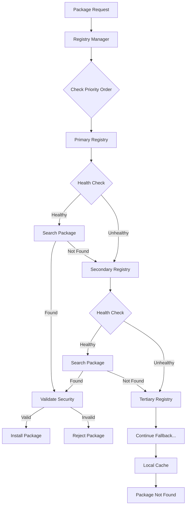

# Registry Fallback Strategy

## Overview

The nvmcp CLI implements a sophisticated **multi-registry fallback strategy** for the MCP ecosystem, providing enterprise-grade reliability and flexibility for package discovery and installation. This system automatically tries multiple registries in priority order, ensuring maximum availability and supporting both official and community-driven registries.

## Architecture



## Default Registry Configuration

The CLI comes pre-configured with three official MCP registries in priority order:

### 1. MCP Community Registry (Priority: 10)
- **URL**: `https://registry.modelcontextprotocol.io`
- **Type**: Official
- **Scope**: `@mcp`
- **Trust Level**: Trusted
- **Features**: 
  - Official community-maintained registry
  - REST API for package discovery
  - Docker deployment support
  - Health check endpoints
  - Paginated server listings

### 2. MCP Meta-Registry (Priority: 20)
- **URL**: `https://meta.registry.modelcontextprotocol.io`
- **Type**: Community
- **Scope**: `@mcp`
- **Trust Level**: Verified
- **Features**:
  - Aggregates multiple registries
  - Cross-registry search
  - Registry health monitoring

### 3. nvmcp Legacy Registry (Priority: 30)
- **URL**: `https://registry.nvmcp.dev`
- **Type**: Community
- **Scope**: `@mcp`
- **Trust Level**: Verified
- **Features**:
  - Legacy compatibility
  - Fallback for older packages

## Registry Management Commands

### Add Registry

Add a new registry to the fallback chain:

```bash
# Basic registry addition
nvmcp registry add https://my-registry.com --name "My Registry"

# Enterprise registry with full configuration
nvmcp registry add https://enterprise.company.com/mcp \
  --name "Company Enterprise Registry" \
  --type enterprise \
  --scope @company \
  --token $REGISTRY_TOKEN \
  --priority 5 \
  --trust-level trusted \
  --require-signed \
  --timeout 10000
```

**Options:**
- `--name, -n`: Human-readable registry name
- `--scope, -s`: Package scope (e.g., @mcp, @company)
- `--token, -t`: Authentication token
- `--type`: Registry type (official, community, enterprise, local)
- `--priority`: Priority order (lower = higher priority)
- `--trust-level`: Security trust level (trusted, verified, unverified)
- `--require-signed`: Require package signatures
- `--timeout`: Request timeout in milliseconds

### List Registries

View all configured registries:

```bash
# Basic list
nvmcp registry list

# Detailed view with health checks
nvmcp registry list --verbose --health-check

# JSON output for automation
nvmcp registry list --format json

# YAML output
nvmcp registry list --format yaml
```

**Output Example:**
```
Registry Configuration:
────────────────────────────────────────────────────────────────────────────────────────────────────────────

1. ✅ 🟢 Enterprise Registry
   URL:      https://enterprise.company.com/mcp
   Type:     enterprise
   Priority: 5
   Scope:    @company
   Health:   healthy (45ms)
   Trust:    trusted
   Signed:   required

2. ✅ 🟢 MCP Community Registry
   URL:      https://registry.modelcontextprotocol.io
   Type:     official
   Priority: 10
   Scope:    @mcp
   Health:   healthy (120ms)
   Trust:    trusted
   Signed:   required

Registry Statistics:
Total: 4 | Healthy: 3 | Degraded: 1 | Unhealthy: 0
Average Response Time: 85ms
```

### Remove Registry

Remove a registry from the fallback chain:

```bash
# Remove by name
nvmcp registry remove "Enterprise Registry"

# Remove by URL
nvmcp registry remove https://old-registry.com
```

### Verify Registry Health

Check the health status of registries:

```bash
# Verify all registries
nvmcp registry verify

# Verify specific registry
nvmcp registry verify --registry "MCP Community Registry"

# JSON output for monitoring
nvmcp registry verify --json
```

**Health Status Indicators:**
- ✅ **Healthy**: Response time < 5s, all endpoints working
- ⚠️ **Degraded**: Response time > 5s but functional
- ❌ **Unhealthy**: Timeout, errors, or unreachable

### Registry Statistics

View comprehensive registry statistics:

```bash
nvmcp registry stats
```

**Output:**
```
Registry Statistics:
────────────────────────────────────────
Total Registries:     4
Healthy Registries:   3
Degraded Registries:  1
Unhealthy Registries: 0
Average Response:     85ms

Overall Health: ✅ Excellent (75%)
```

### Clear Cache

Clear registry response cache:

```bash
nvmcp registry clear-cache
```

## Security Features

### Package Validation

The fallback strategy includes comprehensive security validation:

```typescript
// Automatic security checks
security: {
  allowUnsignedPackages: false,        // Enforce signed packages
  trustedRegistries: [                 // Whitelist trusted registries
    'https://registry.modelcontextprotocol.io',
    'https://meta.registry.modelcontextprotocol.io'
  ],
  sandboxMode: true,                   // Isolate MCP execution
  licenseValidation: {
    enabled: true,
    allowedLicenses: ['MIT', 'Apache-2.0', 'BSD-3-Clause', 'ISC'],
    rejectUnlicensed: true,
    allowCustomLicenses: false
  }
}
```

### Trust Levels

Registries are classified by trust level:

- **Trusted**: Official registries with full security validation
- **Verified**: Community registries with basic validation
- **Unverified**: Custom registries requiring manual approval

### License Enforcement

Automatic license validation prevents installation of packages with incompatible licenses:

```bash
# Configure allowed licenses
nvmcp config set security.licenseValidation.allowedLicenses "MIT,Apache-2.0,BSD-3-Clause"

# Reject unlicensed packages
nvmcp config set security.licenseValidation.rejectUnlicensed true
```

## Performance Optimization

### Caching Strategy

- **Response Cache**: 5-minute TTL for package metadata
- **Health Cache**: 5-minute TTL for registry health status
- **Parallel Requests**: Up to 4 concurrent registry requests
- **Timeout Management**: Configurable per-registry timeouts

### Health Monitoring

Continuous health monitoring ensures optimal performance:

- **Automatic Health Checks**: Every 5 minutes
- **Response Time Tracking**: Performance metrics collection
- **Degraded Registry Detection**: Automatic fallback for slow registries
- **Circuit Breaker Pattern**: Temporary registry disabling for failures

## Enterprise Configuration

### Azure API Center Integration

For enterprise environments, integrate with Azure API Center:

```bash
nvmcp registry add https://your-org.azure-api.net/mcp \
  --name "Azure Enterprise Registry" \
  --type enterprise \
  --priority 1 \
  --trust-level trusted \
  --require-signed \
  --token $AZURE_API_TOKEN
```

### Private Registry Setup

Configure private registries for internal packages:

```bash
nvmcp registry add https://internal.company.com/mcp \
  --name "Internal Registry" \
  --type enterprise \
  --scope @internal \
  --priority 2 \
  --trust-level trusted \
  --token $INTERNAL_TOKEN
```

## Configuration File

Registry configuration is stored in `.nvmcprc`:

```json
{
  "registries": [
    {
      "name": "Enterprise Registry",
      "url": "https://enterprise.company.com/mcp",
      "scope": "@company",
      "type": "enterprise",
      "priority": 5,
      "enabled": true,
      "timeout": 30000,
      "retries": 3,
      "healthCheck": {
        "enabled": true,
        "endpoint": "/health",
        "interval": 300000
      },
      "security": {
        "requireSigned": true,
        "allowedLicenses": ["MIT", "Apache-2.0"],
        "trustLevel": "trusted"
      }
    }
  ],
  "security": {
    "allowUnsignedPackages": false,
    "trustedRegistries": [
      "https://registry.modelcontextprotocol.io",
      "https://enterprise.company.com/mcp"
    ],
    "sandboxMode": true,
    "licenseValidation": {
      "enabled": true,
      "allowedLicenses": ["MIT", "Apache-2.0", "BSD-3-Clause"],
      "rejectUnlicensed": true
    }
  }
}
```

## Automation & CI/CD

### GitHub Actions Integration

```yaml
name: MCP Package Installation
on: [push, pull_request]

jobs:
  install:
    runs-on: ubuntu-latest
    steps:
      - uses: actions/checkout@v3
      
      - name: Setup nvmcp
        run: npm install -g @nvmcp/cli
        
      - name: Configure Enterprise Registry
        run: |
          nvmcp registry add ${{ secrets.ENTERPRISE_REGISTRY_URL }} \
            --name "Enterprise Registry" \
            --type enterprise \
            --token ${{ secrets.REGISTRY_TOKEN }} \
            --priority 1
            
      - name: Verify Registry Health
        run: nvmcp registry verify --json
        
      - name: Install MCP Packages
        run: nvmcp add @company/mcp-tools @mcp/core
```

### Docker Integration

```dockerfile
FROM node:18-alpine

# Install nvmcp CLI
RUN npm install -g @nvmcp/cli

# Configure registries
COPY .nvmcprc /root/.nvmcp/config.json

# Verify registry health
RUN nvmcp registry verify

# Install packages
RUN nvmcp add @mcp/core @company/tools
```

## Monitoring & Observability

### Health Check Endpoints

Monitor registry health programmatically:

```bash
# Get health status as JSON
nvmcp registry verify --json | jq '.[] | select(.status != "healthy")'

# Monitor response times
nvmcp registry stats --json | jq '.averageResponseTime'
```

### Alerting Integration

Set up alerts for registry failures:

```bash
#!/bin/bash
# registry-health-check.sh

HEALTH=$(nvmcp registry verify --json)
UNHEALTHY=$(echo $HEALTH | jq '[.[] | select(.status == "unhealthy")] | length')

if [ "$UNHEALTHY" -gt 0 ]; then
  echo "Alert: $UNHEALTHY registries are unhealthy"
  # Send alert to monitoring system
  curl -X POST "$WEBHOOK_URL" -d "{\"text\": \"$UNHEALTHY MCP registries are unhealthy\"}"
fi
```

## Best Practices

### Registry Priority Strategy

1. **Enterprise/Internal** (Priority 1-10): Private company registries
2. **Official** (Priority 10-20): MCP community registries  
3. **Community** (Priority 20-50): Third-party registries
4. **Local/Development** (Priority 50+): Local test registries

### Security Guidelines

1. **Always use HTTPS** for registry URLs
2. **Enable package signing** for production environments
3. **Regularly audit** allowed licenses
4. **Monitor registry health** continuously
5. **Use authentication tokens** for private registries

### Performance Optimization

1. **Set appropriate timeouts** based on network conditions
2. **Use caching** to reduce registry load
3. **Monitor response times** and adjust priorities
4. **Implement circuit breakers** for unreliable registries

## Troubleshooting

### Common Issues

**Registry Not Responding:**
```bash
# Check registry health
nvmcp registry verify --registry "Registry Name"

# Clear cache and retry
nvmcp registry clear-cache
nvmcp registry verify
```

**Package Not Found:**
```bash
# List all registries and their status
nvmcp registry list --health-check

# Verify package exists in specific registry
nvmcp search package-name --registry "Registry Name"
```

**Authentication Failures:**
```bash
# Update registry token
nvmcp registry remove "Registry Name"
nvmcp registry add https://registry.url --token $NEW_TOKEN
```

**Performance Issues:**
```bash
# Check response times
nvmcp registry stats

# Adjust timeouts for slow registries
nvmcp config set registries.timeout 60000
```

## API Reference

### Registry Manager Class

```typescript
import { createRegistryManager } from '@nvmcp/cli'

const registryManager = createRegistryManager()

// Search for package across all registries
const result = await registryManager.searchPackage('package-name')

// Check registry health
const health = await registryManager.checkRegistryHealth(registry)

// Get statistics
const stats = await registryManager.getStatistics()
```

## Future Enhancements

### Planned Features

- **Smart Failover**: Automatic registry reordering based on performance
- **Load Balancing**: Distribute requests across healthy registries
- **Offline Mode**: Local package cache for disconnected environments
- **Registry Mirroring**: Automatic synchronization between registries
- **Advanced Analytics**: Detailed usage and performance metrics

### Community Contributions

The registry fallback strategy is designed to be extensible. Contributions are welcome for:

- New registry adapters
- Enhanced security features
- Performance optimizations
- Monitoring integrations

---

## Summary

The nvmcp CLI registry fallback strategy provides:

✅ **Enterprise-grade reliability** with automatic failover  
✅ **Security-first approach** with package validation  
✅ **Performance optimization** with caching and health monitoring  
✅ **Flexible configuration** for any environment  
✅ **Comprehensive monitoring** and observability  
✅ **Easy automation** for CI/CD pipelines  

This implementation sets a new standard for package registry management in the MCP ecosystem, ensuring maximum availability and security for all users. 